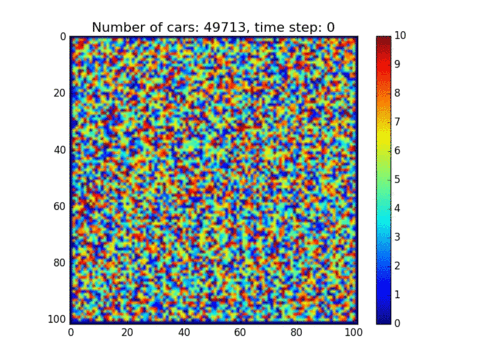
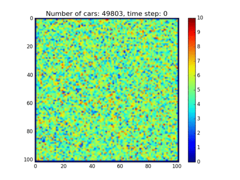

**This is NOT a released version, currently only for developing purpose**
# vehicle-evacuation
a CUDA implementation of vehicle evacuation model. This implementation can be used as an example of using CUDA to implement an (location aware) Agent-based model. 

#sample-1

map size: 100*100
exit: bottom left, 80<x<=100

#sample-2

map size: 100*100
exit: bottom right, 80 < x <= 100, and right 40 <= y <= 50

#sample-3

with traffic light control

#sample-4

with traffic light control, and four counters for north, east, west and south separately.

#Note
gif was created by https://giphy.com/create/gifmaker with png image plotted by http://matplotlib.org
